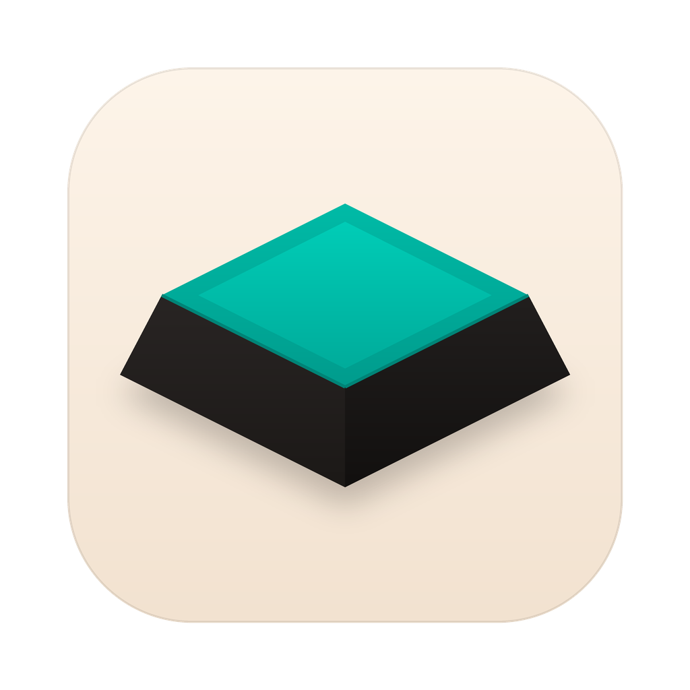

# Klack, cloned

A from-scratch AppKit reproduction of [Klack](https://tryklack.com), the macOS
app that gives your keyboard mechanical switch sounds. Every surface is drawn
with CoreGraphics and CoreText against measured values, and every claim of
fidelity in [LEDGER.md](LEDGER.md) carries the number that backs it.

**This is not Klack, and it is not affiliated with or endorsed by its authors.**
It ships none of Klack's code, artwork, or sound library — see
[NOTICE.md](NOTICE.md). If you want the real thing, buy it; it is good, and the
sample library is the part that took work.

---

## Install

```bash
git clone https://github.com/jappabl/klack-clone.git
cd klack-clone && ./install.sh
```

Builds a universal binary and installs to `/Applications`. Needs macOS 15+ and
the Xcode Command Line Tools (`xcode-select --install`); nothing else — no
Xcode, no SwiftPM, no dependencies.

Or grab `Klack.app.zip` from [Releases](../../releases) if you have no toolchain.
It is unsigned, so strip the quarantine flag before first launch:

```bash
xattr -dr com.apple.quarantine /Applications/Klack.app
```

## Run

```bash
open -a Klack                        # menu bar
open -a Klack --args --settings      # settings window
open -a Klack --args --demo 30       # popover + switches panel, 30s
```

The menu bar shows a **K** keycap; clicking it opens the popover. Shortcuts:
`⌥⌘K` toggle · `⌘,` settings · `⌘Q` quit · `Esc` dismiss.

## Sound

It needs **Input Monitoring** to hear keystrokes system-wide — System Settings ▸
Privacy & Security ▸ Input Monitoring. A listen-only keyboard tap is gated by
`kTCCServiceListenEvent`; Accessibility also permits one, so either grant
works. It never prompts on its own. Without it the app still works, but only
while one of its own windows is focused.

Two things that will otherwise waste your afternoon:

- **Installing over a previous copy invalidates the grant.** macOS pins it to
  the app's code hash, so an entry left from an earlier build does not match
  the new binary — remove it with **−** and add it again, because toggling it
  does nothing. `tools/setup-signing.sh` makes the grant survive rebuilds.
- **Do not check the permission by running the binary from a terminal.** A
  process launched from a trusted shell inherits that shell's trust as the
  responsible process, so it reports success whether or not the app itself has
  the grant. Ask the app instead:

```bash
open -a Klack --args --tap-test
```

  It arms the tap, listens for 12 seconds, and writes what actually arrived to
  `~/Library/Application Support/KlackClone/launch.log`. `EVENTS SEEN: 0` with
  a tap that reports enabled means the grant is not in effect.

Seven switch sets, 139 individually sliced samples, mixed through a 32-voice
engine with a hand-written brickwall limiter. Hear them all without installing
anything: [`shots/klack-switches-demo.wav`](shots/klack-switches-demo.wav).

## What is built, and how close

| surface | result |
|---|---|
| Popover | **1.07 %** differing pixels @2× |
| Switches panel | **1.97 %** @2× |
| Settings window — Sound, Sleep, Stats | worst Δ **0.9 pt** vs the reference video |
| Sound: attack | mean **0.47 ms**, worst slice 1.92 ms |
| Sound: level | worst peak **0.828**, zero clipped samples at 340 wpm |

Measured against floors established first: two captures of the same reference
diff at 0.00 %, and the CoreText-vs-Skia glyph rasteriser alone accounts for
36.76 % of ink pixels. A gate tighter than the floor never closes.

**Not built:** General, Visualizer, Notifications and About panes — no
reference for them was ever published, so they show a placeholder saying so
rather than an invention. Also unbuilt: the settings window's light appearance.
Every gap is listed in the ledger rather than quietly dropped.

## Layout

```
app/Sources/     the app — AppKit, CoreGraphics, AVAudioEngine
assets/switches/ 139 CC0 samples + CREDITS.md
tools/           the measurement harness
LEDGER.md        every measured value, and every failed approach
```

The harness in `tools/` measured the clone against reference captures that are
**not** in this repo — they are scraped from tryklack.com, the App Store listing
and YouTube reviews, and are not mine to redistribute. So those scripts will not
run for you. The numbers they produced are all in the ledger.

Regenerate the icon with `python3 tools/make-icon.py`.

## Licence

[MIT](LICENSE) for the code. Samples are CC0, credited individually in
[`assets/switches/CREDITS.md`](assets/switches/CREDITS.md).
